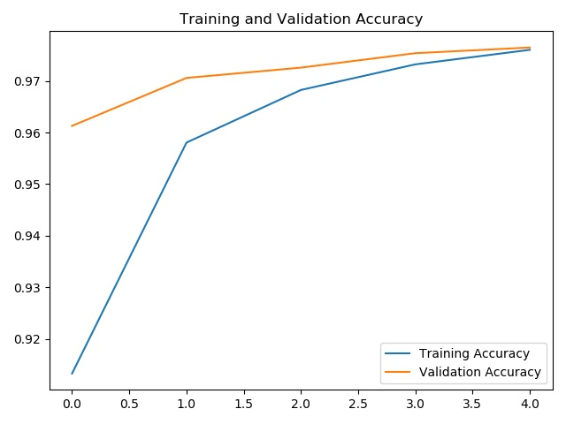
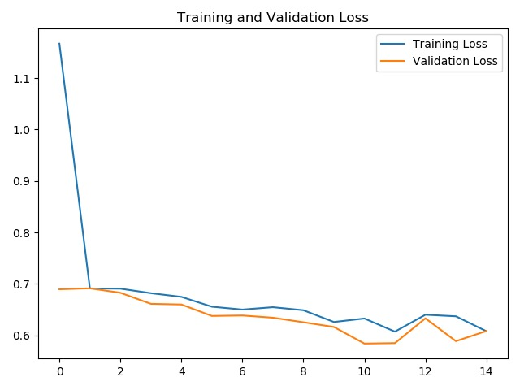
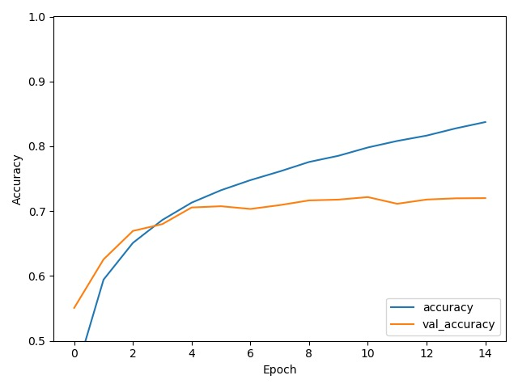
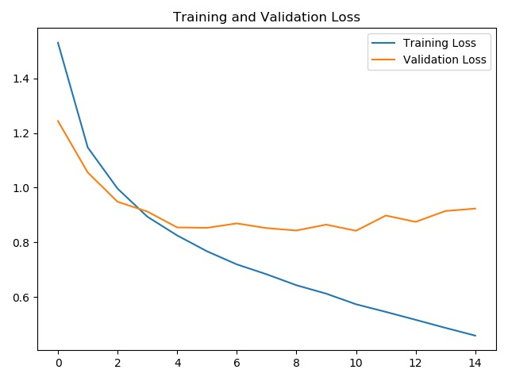
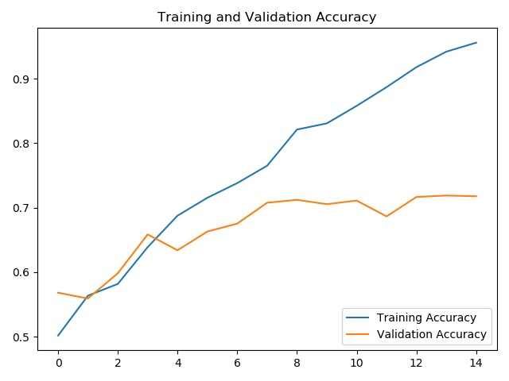
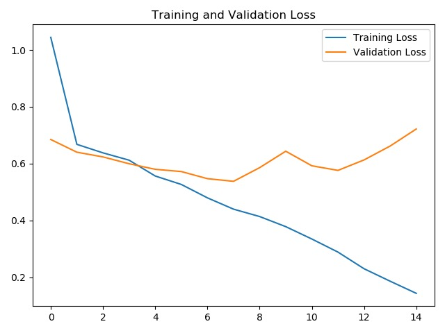
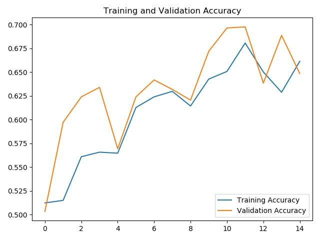
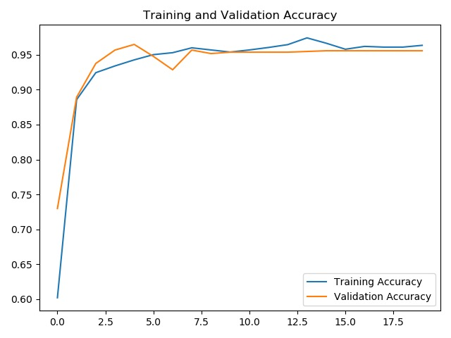
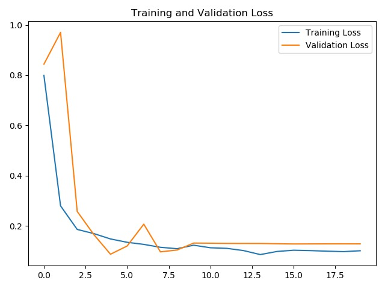

# hust_cv_class
华中科技大学图像训练班

### class1

**MNIST数据集**

**cifar10数据集**

### class2

**Deep Learning 理论介绍**

### class3

**自定义数据集**

**数据增强**

**模型微调**

> By. Jian.Yin
>
> Email: 1262094391@qq.com

